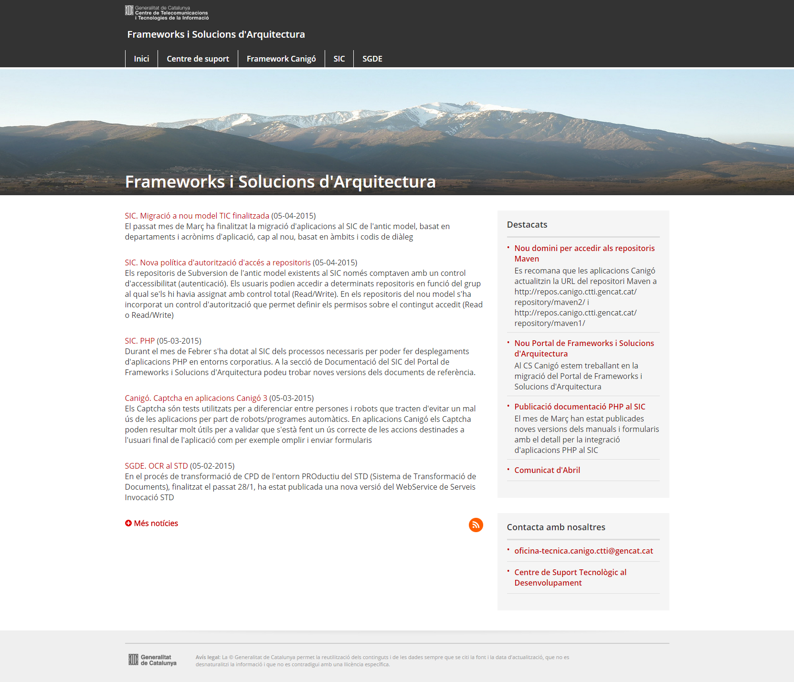
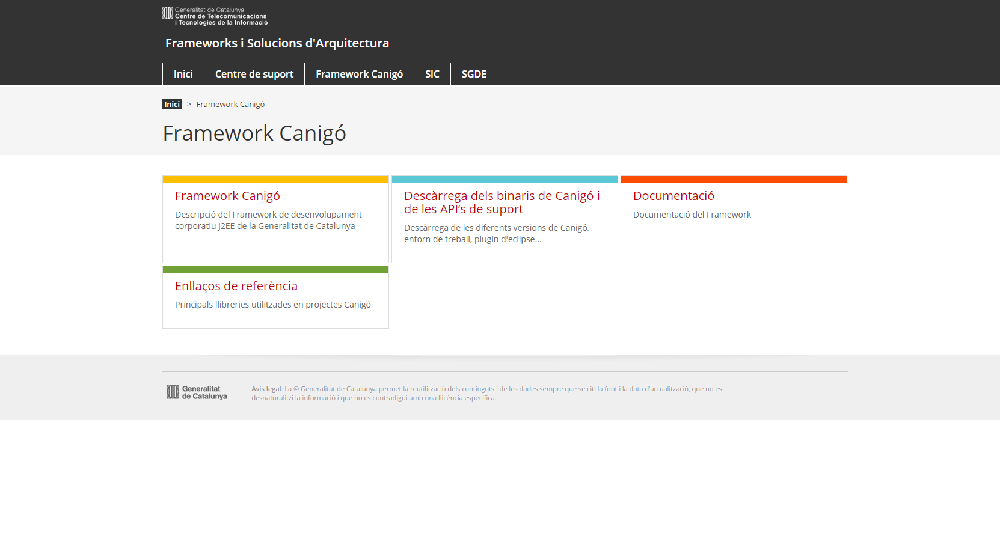
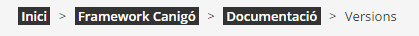
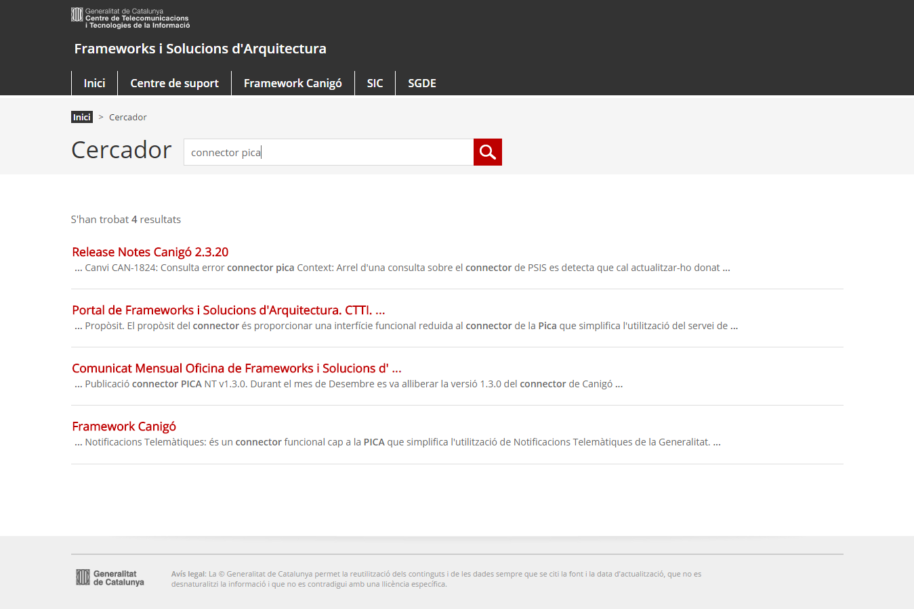

#Webs estàtics amb [Hugo](http://gohugo.io/)

[TOC]

## Prerequisits 

- Descarregar l'instal·lable per al teu sistema: https://github.com/spf13/hugo/releases

- Posar Hugo al PATH del sistema: http://gohugo.io/overview/quickstart/

- Conéixer [markdown](http://ca.wikipedia.org/wiki/Markdown) per a la generació de continguts. Els continguts es creen en text pla, amb les marques pròpies de markdown, que Hugo converteix a html en el procés de generació del web. 

Opcional:

- Crear un compte de github (amb un correu gencat)

- Instal·lar client de [git](http://git-scm.com/downloads)

- Si el web ha de tenir més d'un contribuïdor, s'ha de disposar de OneDrive de Microsoft (o Dropbox) per a poder compartir els continguts.

## Com començar 

Un cop instal·lat l'entorn en la màquina local i obtingudes les plantilles, cal configurar les propietats generals del web al fitxer _config.toml_ de l'arrel.

Exemple del contingut del fitxer:

		languageCode = "ca-Es"
		title = "Portal de Frameworks i Solucions d'Arquitectura. CTTI. Generalitat de Catalunya"

		contentdir = "content"
		layoutdir = "layouts"
		publishdir = "../web-canigo-public"
		builddrafts = false
		baseurl = "http://canigo.ctti.gencat.cat"
		canonifyurls = false

		Paginate = 10

		[params]
			noticieshome = 8
			destacatshome = 5
			google_analytics_id = "UA-XXXXXX-N"			

Un cop configurat aquest fitxer, només cal executar l'script o bat _start-server_.

En acabar d'arrencar l'entorn local, es pot navegar a la url http://localhost:1313 o clicar l'accés directe que ve amb les plantilles.

Cada cop que es guarda un contingut de _markdown_, Hugo genera de nou el site i refresca la url http://localhost:1313 amb les modificacions realitzades, de manera que es pot veure en viu el que s'està fent al web.

## Plantilles gencat 

S'han generat un conjunt de plantilles (layouts en llenguatge Hugo) amb estil gencat que incorporen la graella i formats de continguts més comuns.

### Front-matter 

El front-matter és una secció de meta informació que contenen tots els continguts generats per al web (http://gohugo.io/content/front-matter/). Amb ell, podrem configurar els continguts i certes funcionalitats. Exemple:

		date        = "2015-01-24T17:11:42+01:00" --> data del contingut, útil per a ordenar els llistat de més nou a més antic
		title       = "Framework Canigó" --> títol que es veurà en llistats o seccions
		description = "Descripció del Framework de desenvolupament corporatiu J2EE de la Generalitat de Catalunya" --> descripció que es veurà en llistats o en seccions
		section     = "Canigó" --> secció a la que pertany el contingut (opcional)
		draft 		= true --> mentre el contingut no hagi de ser publicat, informar-ho a true. Es pot treure l'atribut o posar qualsevol altre valor quan es pugui publicar
		toc 		= true --> si el contingut és molt llarg i es vol incloure un índex a les diferents seccions. L'índex es contruirà automàticament a partir dels encapçalaments de nivell 2 (h2), que es generen amb ## a markdown
		weight 		= 1 --> ordre que tindrà dins una secció

### Tipus de plantilles 

#### Home (editable per a adaptar-se a les necessitats del web) 

* Fitxer: _layout/index.html_
* Exemple: http://canigo.ctti.gencat.cat
* Mostra un llistat de les N últimes notícies, ubicades al directori content/noticies. El nombre de notícies a mostrar es configura al fitxer __config.toml__ de l'arrel del projecte
* Mostra tots els continguts dins el directori **content/destacats** en la columna dreta.
* La imatge de la capçalera s'ha d'ubicar al directori **/static/images/banner.jpg**

#### Secció (comú a tots els webs) 

* Fitxer: _layout/_defaults/section.html_
* Exemple: http://canigo.ctti.gencat.cat/canigo/
* És un índex dels continguts d'una carpeta donada
* Es mostra el "title" i "description" del [front matter](http://gohugo.io/content/front-matter/)

#### Contingut individual (comú) 

* Fitxer: _layout/_defaults/single.html_
* Exemple: http://canigo.ctti.gencat.cat/canigo/framework/
* És una pàgina final de continguts
* Amb el paràmetre **_weight_** (numèric) al front matter configurem l'ordre en que s'han de mostrar en la secció.
* Un contingut en el que s'està treballant però que no s'ha de publicar encara, es pot marcar amb el paràmetre **_draft=true_** al front matter, i només es veurà en l'entorn de previsualització.
* Si el contingut és molt llarg, es pot incloure una taula de continguts (àncores a les capçaleres de nivell 2 -##-) incloent al _front matter_ la variable **_toc = true_**

#### Plantilles parcials ("includes") 

##### Breadcrumbs (comú) 

* Fitxer: _layout/partials/breadcrumbs.html_
* Exemple: http://canigo.ctti.gencat.cat/centre-de-suport/que-es-el-cs/

##### Breadcrumbs de subsecció (editable) 

* Fitxer: _layout/partials/breadcrumbs_subsection.html_
* Hugo no suporta (de moment) subseccions, això és, que un directori amb les seves pàgines finals de continguts individual, estigui contingut en un altre directori. Per a simular les subseccions, en organitzar el contingut físicament, en carpetes, aquestes les posem al mateix nivell i gestionem la relació jeràrquica entre dos directoris al mateix nivell, mitjançant el fitxer _layout/partials/breadcrumbs_subsection.html_. Aquest comportament es pot veure a:

	- https://github.com/cs-canigo/cs-canigo.github.io, on les seccions/directoris que comencem amb "canigo-*" estan relacionades amb la que es diu "canigo", però jeràrquicament estan contingudes en ella.
	- al web en viu es pot veure aquí: http://canigo.ctti.gencat.cat/canigo/, on documentació és una subsecció amb les seves pròpies subseccions segons la versió del framework i la categoria dels mòduls (http://canigo.ctti.gencat.cat/canigo-documentacio-versions/)

##### Capçalera (editable) i peu (comú) 

* Fitxer capçalera: _layout/partials/head.html_

		<meta charset="UTF-8" />
		<meta http-equiv="X-UA-Compatible" content="IE=edge" />
		<meta name="viewport" content="width=device-width, initial-scale=1.0" />
		<title>Portal de Frameworks i Solucions d'Arquitectura. CTTI. Generalitat de Catalunya</title>
		<link rel="shortcut icon" type="image/x-icon" href="/img/favicon.ico" />
		<link href="/css/master.min.css" rel="stylesheet" type="text/css" />
		<link href="/css/canigo.css" rel="stylesheet" type="text/css" />
		

* Fitxer peu: __layout/partials/footer.html__

##### Menú (editable) 

* Fitxer: _layout/partials/menu.html_

##### Taula de continguts - TOC (comú)  

* Fitxer: _layout/partials/table-of-contents.html_
* Permet visualitzar una sèrie d'àncores en continguts individuals (mostrats pel layout/_defaults/single.html) quan aquest contingut és molt llarg.
* Exemple: http://canigo.ctti.gencat.cat/canigo/framework/
* S'activa individualment a un contingut indicant al _front matter_ la variable **toc = true**

##### Títols de subsecció (editable) 

* Fitxer: _layout/partials/titles-subsection.html_

## Notícies 

Les notícies són continguts normals que es creen com a plantilla simple (contingut individual, -_layouts/_default/single.html_-) i que es mostren en diferents llocs del web:

- com a llista paginada dins la secció de notícies. El nombre d'elements per pàgina en aquesta secció es configura amb la propietat _Paginate_ dins el fitxer _config.toml_.
- llista de notícies a la home. El nombre de notícies que es mostren a la home, es configura amb la propietat _noticieshome_ dins _[params]_ al fitxer _config.toml_
- al comunicat

Independentment d'on es mostri, per a les notícies s'ha d'informar dins el front-matter la propietat _description_ amb un resum de la notícia, que és el que es mostrarà en les diferents seccions on es mostri la notícia.

## Destacats

Són aquells continguts que es mostren a la part dreta de la home de la nova web de Canigo. Si indiquem el paràmetre **enllac** al front-matter, en el títul del contingut es generarà un link a l'adreça que s'indiqui; si no s'indica aquest paràmetre, només es mostra el títol amb el mateix estils que els links.

## Cercador 

El _/cercador_ permet cercar sobre continguts del web en general (capsa de cerca del menú) o notícies (capsa de cerca dins la secció de notícies), quan es va a l'índex de notícies. Fa una integració amb el cercador.gencat.cat (Google Search Appliance) i mostra els continguts a la web.

Es basa en:

- un fitxer javascript que s'encarrega de consultar l'api del GSA i mostrar els continguts al web (_/static/js/cercador.js_). 

- una pàgina estàtica que es pot trobar a _/contingut/cercador.md_, que carrega el fitxer .js anterior

- Per a que funcioni, s'ha de configurar el "submit" del formulari de cerca de manera que canvïi la url a _/cercador#?query={valor de la cerca}&site={col·lecció google search appliance}_. D'aquesta manera el javascript recuperarà el valor a cercar i farà la consulta i pintat dels continguts a la pàgina.  

- Per a restringir els continguts a una ruta concreta, per exemple a les notícies, s'ha d'enviar a la url un nou paràmetre (_sitesearch_) amb el valor del path en el que cercar, en el cas de Canigó, les notícies estan a _/noticies_ per tant, la url de cerca hauria de ser: http://canigo.ctti.gencat.cat/cercador/#?query=plugin&type=noticies&sitesearch=canigo.ctti.gencat.cat/noticies

Resultat de la cerca http://canigo.ctti.gencat.cat/cercador/#?query=connector%20pica

## Comunicats 

Els comunicats es generen de manera dinàmica a partir dels continguts que ja existeixen al web. 

* Per a crear un nou comunicat s'ha de crear la carpeta corresponent al mes a _content/comunicat_. Per exemple, per a crear el comunicat de Juliol del 2015, haurem de crear el fitxer de markdown a la ruta _content/comunicat/2015/07.md_

	- Si creem aquest arxiu per línia de comanda, és generarà automàticament el "front matter" base del comunicat. En aquesta capçalera, tenim:

		* **nombrenoticies:** Nombre de notícies a incloure al comunicat.
		* **nombredestacats:** Nombre de destacats:
		* **relacionats:** Per cada how-to que es vulgui incloure, aquest conjunt d'atributs.
		* S'ha de tenir en  compte que a "doctype" ha de correspondre amb les imatges que tenim static/img/ico_descarregable_TIPUS.png
		* A la gràfica mensual indicada en el paràmetre **[grafica]**, la propietat **imatge** correspon a imatges ubicades a /related/cs/AnyComunicat/MesComunicat/  

    - Exemple de Front-matter

			title             = "Comunicat"
			date              = "2015-06-04"
			nombrenoticies    = 2
			nombredestacats   = 3
			draft             = true

			[[relacionats]]
			doctitle          = "Configuració GICAR i CORS"
			docdescription    = "Configuració GICAR i CORS amb proxy invers Apache en aplicacions REST+HTML5/JS"
			docurl            = "/related/canigo/howto/Canigó - Configuració GICAR-CORS amb Apache en aplicacions REST_HTML5_JS.pdf"
			doctype           = "PDF"  

			[grafica]
			titol      = "Evolució de l'activitat a l'Autoservei"  
			descripcio = "Aquesta és l’evolució de l'activitat de l'Autoservei de eFormularis des de 2014:"  
			imatge     = "Activitat_Autoservei_PRO.PNG"  
			alt        = "Activitat Autoservei eFormularis"  
        
        
	- Resultat de comunicat generat per l'anterior front-matter

## Publicació 

Hugo genera contingut estàtic, així que només cal un servidor web per a publicar els continguts generats per l'eina.

###  Github 

Per a publicar el web a github, cal instal·lar el client de [git](http://git-scm.com/downloads):

- Cal configurar el repositori en el qual es publicaran els continguts: https://help.github.com/articles/set-up-git/

- En l'arrel del directori configurat com a la propietat _publishdir_ del fitxer _config.toml_ (p.e. "web-canigo-public") quedarà ubicat el contingut del repositori Git. Un cop configurat el repositori, s'haurà generat un directori _".git"_ amb meta-informació per el control de versions.

- Executar el bat o script publish-github. Aquest batch:

	- Elimina el contingut del directori "web-canigo-public" (o el que estigui configurat al fitxer _config.toml_)
	- Genera les planes a partir del contingut i les templates (comanda "hugo"). Recordar que en aquest directori no es genera el contingut marcat com a _draft_.
	- Publica a github els canvis realitzats (demanarà usuari i password)

Cal anar en compte amb les minúscules i majúscules, tant en el noms dels fitxers de contingut com en els enllaços, donat que Github és "case sensitive". Es recomana que tot estigui en minúscules.

### Altres servidors webs 

- Executar la comanda "hugo" per línia de comanda al directori on estigui el web a publicar
- Hugo generarà el web al directori que estigui configurat a la propietat _publishdir_ del fitxer _config.toml_
- El contingut d'aquest directori es pot publicar al servidor web escollit directament.

## Google Analytics 

Les plantilles inclouen la marca d'analítica de Google al fitxer _/static/js/custom.js_. Dins d'aquest fitxer s'ha de configurar la següent línia...

		ga('create', 'UA-XXXXXXXX-1', 'auto');

...amb l'identificador UA-XXXXXXXX del web que s'hagi configurat a Google Analytics (igual que en el cas de github, s'hauria d'utilitzar un compte @gencat.cat per a crear el compte).
